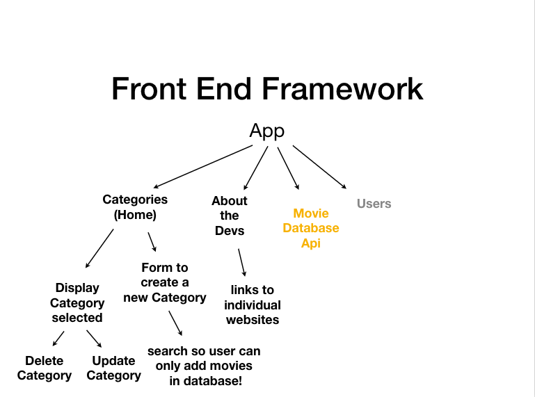

# trailer-tracker-backend

## This is an app that allows users to search Movie trailers in our database and OMBD’s database for the purpose of finding trailers for movies they may want to add to a play list or category.

Our backend is located here :
https://trailerstracker.herokuapp.com/Category

## Wireframe Images

---

##Motivation

Watching movies in general should be easy and fun. Being able to search a category and find trailers for the desired movie is an overlooked luxury. Our site makes this process easy and convenient.




---

##Getting Started

We started the project by brainstorming what we thought was different from apps that are out there currently.
We create a user flow chart and a reference for our routes.

The frameworks used for this project includes React, CSS, Express, MongoDB, Heroku, and Mongoose, and BootStrap.

For the backend we started with the index.js , models, controllers, and seeding our database.We used 2 models: Category and Movies. The category set up was straight forward and included full CRUD. The Movie model set up had more to it. We incorporated Youtube and OMBD’s api. Our backend searches OMBD’s api by title and creates an instance of our Movie Model with title, genre, poster, and released year information. Then it searches Youtube’s api return results based on the title. We narrowed it down to only show Trailers of the title and will only return one result.

To connect our Front and Back End we made sure to do a few additional steps. These included downloading and incorporating cors. We required it in our index.js.

```const cors = require('cors');

```

Made sure our backend knew to use it.

```
app.use(cors());


```

While working on the project we had to make sure our backend and frontend were not listening on the same ports.

We then connected our backend to Heroku and seeded our Heroku database.
